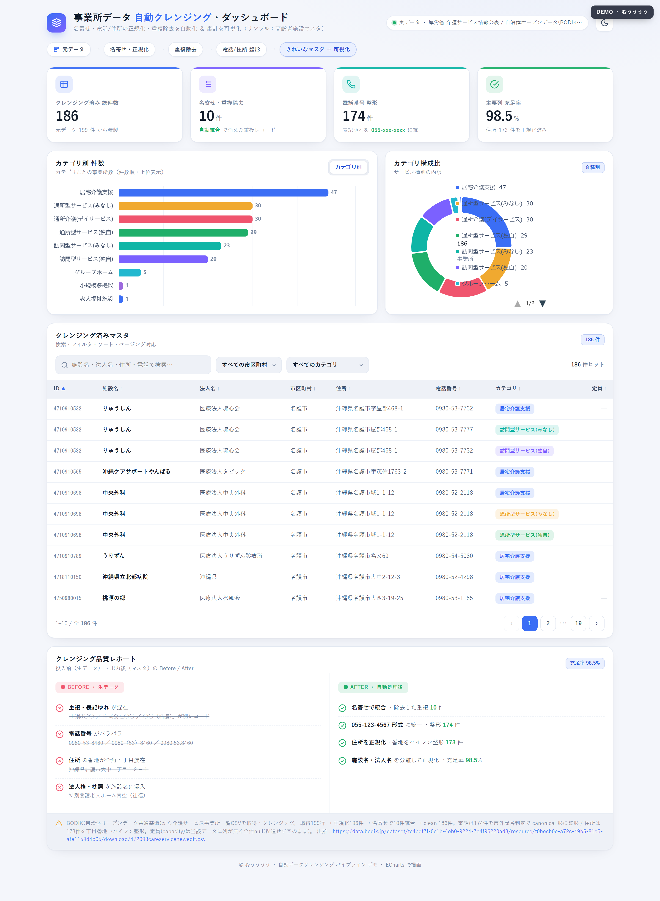
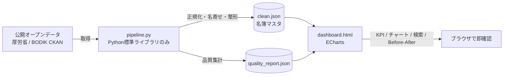

# 事業所データ 自動クレンジング & ダッシュボード

> 汚れた公開CSVを、人手ゼロで「営業に使える名簿マスタ」に変換し、そのまま見られるダッシュボードまで一気通貫で出力するツール。


-brightgreen)


---

## 🎯 誰の・どんな課題を解決するか (Who / What)

名簿・顧客リスト・公開データのCSVは、現場ではいつもこの状態で届きます。

- 法人名の表記ゆれ（`㈱` / `(株)` / `株式会社` がバラバラ）
- 住所が全角・漢数字・丁目番地でバラバラ（`名護市大中二丁目１２－１`）
- 電話番号にハイフンが無い／市外局番の桁数がバラバラで機械処理で壊れる
- 同じ事業所が複数行に重複
- 列の歯抜け（どこが欠けているか分からない）

**Excelで手作業整形すると数百件で半日〜1日。しかも毎月発生する。** そこを丸ごと自動化します。

---

## ✨ できること (Features)

| # | 処理 | 内容 |
|---|------|------|
| 1 | 法人名の正規化 | `㈱`→`株式会社`、全半角統一、末尾法人格を先頭へ寄せ |
| 2 | 施設名から固有名抽出 | `りゅうしん指定居宅介護支援事業所` → `りゅうしん` |
| 3 | 住所の正規化 | `名護市大中二丁目１２－１` → `沖縄県名護市大中2-12-1` |
| 4 | 電話番号の整形 | 市外局番の桁数を局番表で判定してハイフン挿入（携帯/IP/フリーダイヤルも分岐） |
| 5 | 重複の名寄せ | 正規化名＋市区町村＋種別で突合し、情報量の多い方を残して欠損補完 |
| 6 | 行政ノイズ除去 | 施設名＝自治体名の「本体行」を名簿から除外 |
| 7 | 品質の可視化 | 充足率を算出し、ダッシュボードで Before/After を表示 |

---

## 📊 実行結果 (Result) ※実データ・盛っていません

厚労省 介護サービス情報公表のオープンデータ（沖縄県名護市）を実際に処理した数字です。

| 指標 | 値 |
|------|-----|
| 取り込み（生データ） | **199 行** |
| 重複の名寄せで統合 | **13 件** |
| クレンジング済み | **186 件** |
| 電話番号を正規形へ整形 | **174 件** |
| 住所をハイフン整形 | **173 件** |
| 主要列の充足率 | **98.5%** |

**変換例**：`㈱　こころ` → `株式会社こころ` ／ `0980537732` → `0980-53-7732`



---

## 🏗 アーキテクチャ (How)



**設計の芯**：数値処理（正規化・名寄せ・集計）は決定論的なコードで正確に。判断が要る所だけ人が見る。

---

## 🛠 技術スタック

- **データ処理**：Python（**標準ライブラリのみ・pip依存ゼロ**）。`pipeline.py` 単体で取得→クレンジング→出力まで完結
- **ダッシュボード**：単一HTML。チャートは実ライブラリ **ECharts**（手描き図形なし）。KPIカード・全文検索＋ソート＋ページング・Before/After品質レポート内蔵・ダーク/ライト対応
- **CI**：GitHub Actions で push 時にパイプラインを自動実行し、出力を検証（`.github/workflows/ci.yml`）

---

## 🚀 使い方

```bash
python pipeline.py          # data/clean.json と data/quality_report.json を生成
# dashboard.html をブラウザで開く（サーバー不要）
```

**実運用では、入力をお客様の実CSVに差し替えるだけ**で同じパイプラインが動きます。

---

## 📝 正直な注記

- データは1自治体（名護市）分。複数自治体マージで件数は増やせます
- 定員(capacity)は取得元CSVに列が無いため空欄（捏造せず null のまま）
- 出所：厚生労働省 介護サービス情報公表系オープンデータ（自治体オープンデータ共通基盤 BODIK 経由）

## 📄 ライセンス

MIT License. 使用データは各自治体の公開オープンデータ（出所は上記）。
